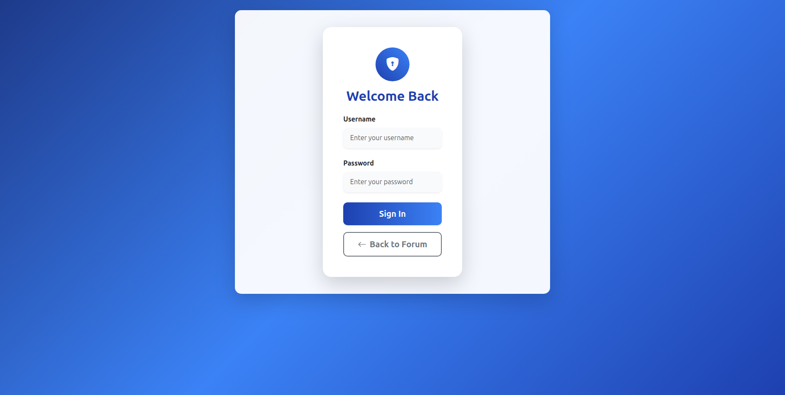
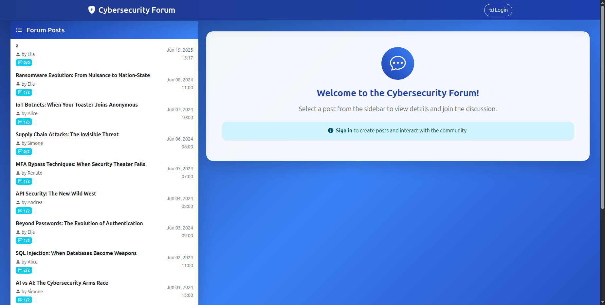
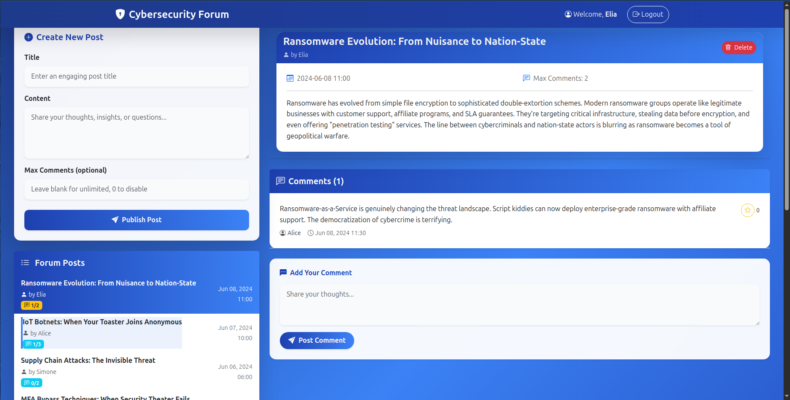

# Cybersecurity Forum - Web Application Project

A modern forum application built with React and Express.js, featuring user authentication, 2FA for administrators, and anonymous posting capabilities.

## 1. Server-side

### HTTP APIs

#### Authentication APIs
- `POST /api/sessions` - User login with username and password. Body: {username, password}. Returns user info and canDoTotp flag.
- `POST /api/login-totp` - TOTP verification for admin users. Body: {code}. Returns success confirmation.
- `DELETE /api/sessions/current` - User logout. Destroys the current session and returns 204.
- `GET /api/sessions/current` - Get current user information. Returns user object with authentication status.

#### Posts APIs
- `GET /api/posts` - Retrieve all posts with author, timestamp, and comment count. Returns array of post objects.
- `GET /api/posts/:id` - Get a specific post by ID with full details. Returns single post object.
- `POST /api/posts` - Create a new post (auth required). Body: {title, text, max_comments?}. Returns created post ID.
- `DELETE /api/posts/:id` - Delete a post (author or admin with 2FA only). Returns 204 on success.

#### Comments APIs
- `GET /api/posts/:postId/comments` - Get all comments for a post. Returns array of comment objects (filtered for anonymous users).
- `POST /api/posts/:postId/comments` - Add comment to a post. Body: {text}. Can be anonymous or authenticated.
- `PUT /api/comments/:id` - Edit a comment (author or admin with 2FA only). Body: {text}. Returns success status.
- `DELETE /api/comments/:id` - Delete a comment (author or admin with 2FA only). Returns 204 on success.

#### Interesting Comments APIs
- `POST /api/comments/:id/interesting` - Mark a comment as interesting (auth required). Returns 204 on success.
- `DELETE /api/comments/:id/interesting` - Remove interesting mark from a comment (auth required). Returns 204 on success.

### Database Tables

#### users
Purpose: Store user account information and authentication details.
Columns: id, username, name, hash, salt, is_admin, otp_secret

#### posts
Purpose: Store forum posts with metadata and comment limits.
Columns: id, title, text, author_id, timestamp, max_comments

#### comments
Purpose: Store comments associated with posts, supporting anonymous posting.
Columns: id, post_id, author_id, text, timestamp

#### comment_interesting_flags
Purpose: Track which comments users have marked as interesting.
Columns: user_id, comment_id (composite primary key)

## 2. Client-side

### Routes

- `/` - Main forum view displaying post list in sidebar and selected post details with comments in main area.
- `/login` - Authentication page with username/password login and optional TOTP verification for admin users.
- `/post/:postId` - Individual post view (nested route within main forum layout).
- `*` - 404 Not Found page for invalid routes with navigation back to forum.

### Main React Components

#### Core Application Components
- `App` - Root component managing global state, authentication flow, and routing with React Router.
- `ForumLayout` - Main application layout with navigation bar, sidebar for posts, and content area for details.
- `LoginLayout` - Authentication page layout containing login form with conditional TOTP verification.
- `NavigationBar` - Fixed top navigation with user info, admin badges, and login/logout functionality.

#### Forum Feature Components
- `PostList` - Sidebar component displaying all forum posts with selection, timestamps, and comment counts.
- `PostDetails` - Main content area showing selected post with delete functionality for authorized users.
- `CommentList` - Display comments with edit, delete, and interesting mark features for authenticated users.
- `AddPostForm` - Form for creating new posts with title, content, and optional comment limits (auth required).
- `AddCommentForm` - Form for adding comments supporting both authenticated and anonymous submissions.
- `LoginForm` - Authentication form supporting regular login and TOTP verification with skip option for admins.


## 3. Overall

### Screenshots

#### Login Page


#### Page Not Found


#### Main Page (Unauthenticated User)


#### Main Page (Authenticated User)


#### Main Page (Admin User)


### User Credentials

#### Regular Users
- **Username**: `Alice` | **Password**: `pwd` | **Admin**: No
- **Username**: `Elia` | **Password**: `pwd` | **Admin**: No  
- **Username**: `Andrea` | **Password**: `pwd` | **Admin**: No

#### Administrator Users
- **Username**: `Ren` | **Password**: `pwd` | **Admin**: Yes | **2FA**: Required for full privileges
- **Username**: `Simone` | **Password**: `pwd` | **Admin**: Yes | **2FA**: Required for full privileges

**Note**: Admin users can login without 2FA but will have limited access. Full admin privileges (post/comment deletion) require TOTP verification.

## Installation and Setup

1. **Server Setup**:
   ```bash
   cd server
   npm install
   npm start
   ```

2. **Client Setup**:
   ```bash
   cd client
   npm install
   npm run dev
   ```

3. **Database**: SQLite database is automatically initialized from schema in `server/database/forum.sql` with sample data.

## Features

- **Responsive Design**: Bootstrap-based UI optimized for desktop and mobile devices
- **Anonymous Posting**: Users can create posts and comments without authentication
- **Two-Factor Authentication**: TOTP-based 2FA for administrator accounts with authenticator app support
- **Comment Management**: Mark comments as interesting, edit own comments, and delete with proper permissions
- **Post Moderation**: Authors and admins can delete posts with cascading deletion of associated comments
- **Real-time Updates**: Dynamic content updates without page refresh using React state management